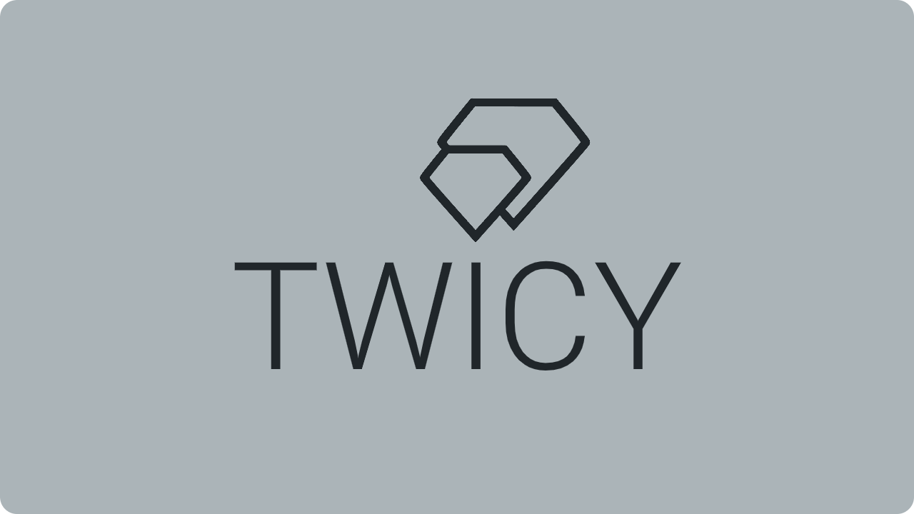
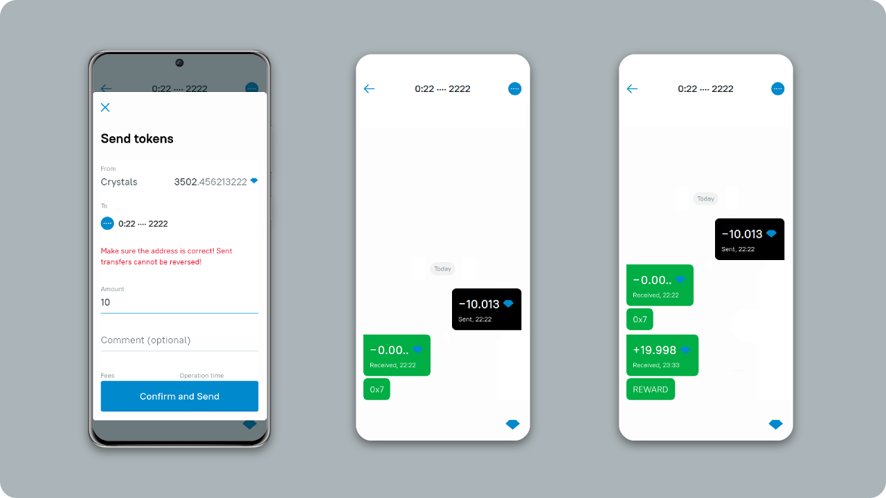
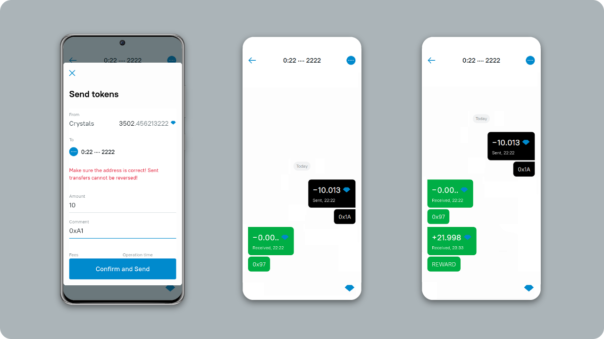
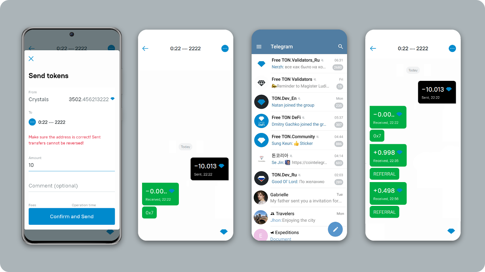
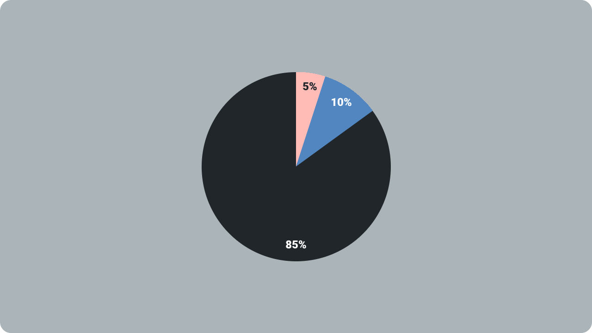
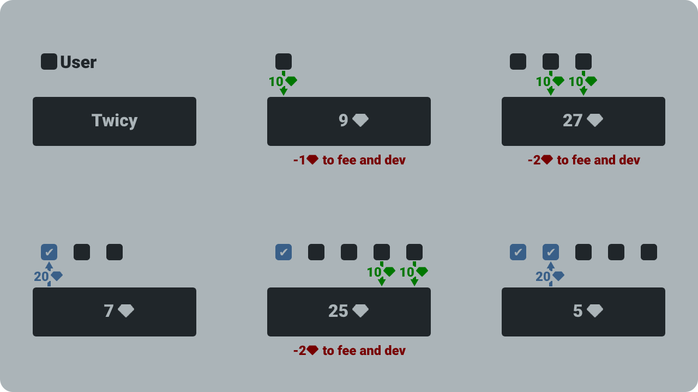
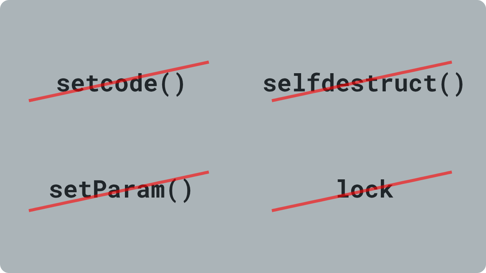
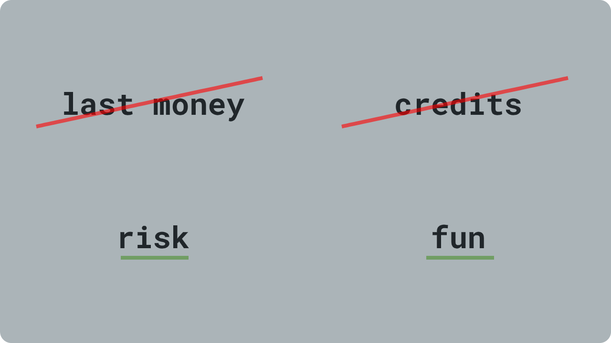
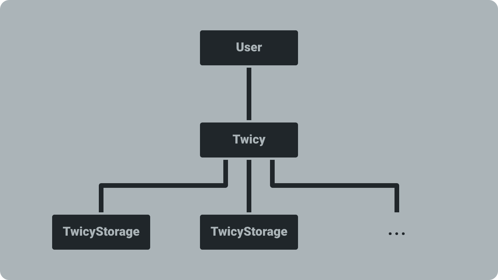

# Twisy

First risk-game on Free TON

## How to play

* Send 10💎 to smart-contract via [Surf](https://ton.surf/). Minimum is 5💎. Maximum is 500💎
* Get an answer and wait your turn
* Get 20💎

## How to get x2.2

* Send 10💎 to smart-contract
  * Get a referral ID from another player
  * Write referral ID in the comment field
* Get an answer and wait your turn
* Get 22💎

Own referral ID do not give you bonus multiplier

## Earn more — become referrer

 * Send 10💎 to smart-contract
 * Receive referral ID in answer
 * Invite other users to the game. Ask them to make a deposit and input the deposit ID in the comment to the transfer
 * You will get 0.5💎 from every 10💎 your referrals deposits

## Economics

* **85%** - 8.5💎 from every 10💎 - payouts to participants
* **10%** - 1💎 from every 10💎 - developers reward and fee for smart-contracts
* **5%** - 0.5💎 from every 10💎 - referrer reward if user set referral ID. If referral ID doesn't set, then part pay outs to participants
 
## How it works

Participants receive payments in turn.
 
 
## Security

* **No setcode().** Nobody can change the contract
* **No selfdestruct().** Nobody can destroy the contract
* **No setters.** Nobody can change parameters of contract
* **Doesn't store many crystals.** Nobody can steal all crystals

## Responsibility game

* Don't play on last money
* Don't take credits to play
* Play at own risk
* It's just fun

## Tech
### Structure

* **User** - user wallet
* **Twicy** - main contract. Collects crystals and pays out rewards
* **TwicyStorage** - Deployed by main contract. It stores information about deposits

### Call stacks
#### Deposit
```
Twicy.deposit()
  _depositWithoutReferralBonus()
    _deposit()
      _depositConfirmation()
        → 0.001💎 to USER
      _save()
        → 0.2💎 to TwicyStorage.save()
      _dispatchDepositsForPayout()
        → 0.2💎 to TwicyStorage.dispatchDepositsForPayout()
          → +0.1💎 to Twicy.onReceiveDepositsForPayout()
            → reward 💎 to USER
```

#### Deposit with referral id
```
Twicy.depositWithReferralId()
  _dispatchReferrerAddress()
    → 0.2💎 to TwicyStorage.dispatchReferrerAddress()
      → +0.1💎 to Twicy.onReceiveReferrerAddress()
        → reward 💎 to REFERRER
        _depositWithReferralBonus() or _depositWithoutReferralBonus()
          _deposit()
             
          ... same as simple deposit
```

### Deploy
#### 1. Compile TwicyStorage
```sh
solc TwicyStorage.sol
tvm_linker compile TwicyStorage.code --lib /home/noop/Projects/TON-Solidity-Compiler/lib/stdlib_sol.tvm
rm TwicyStorage.tvc
rename "s/[0123456789abcdef]{64}\.tvc/TwicyStorage\.tvc/" *.tvc
tvm_linker decode --tvc a23244fa15bc2aa1cdaf97a9dd824c421aac4e1e5ab48367d3572a1c3bec4d4d.tvc > code.txt
```

#### 2. Copy code from code.txt
```text
te6ccgECKgEAB1MAAib/APSk ... yPOAB8AH4R26S8jze
```

#### 3. Compile Twicy
```sh
solc Twicy.sol
tvm_linker compile Twicy.code --lib /path/to/TON-Solidity-Compiler/lib/stdlib_sol.tvm
rm Twicy.tvc
rename "s/[0123456789abcdef]{64}\.tvc/Twicy\.tvc/" *.tvc
tonos-cli genaddr Twicy.tvc Twicy.abi.json --genkey Twicy.keys.json
```

#### 4. Send minimum 3💎 on generated address and deploy
```sh
tonos-cli deploy Twicy.tvc '{"storageCode": "te6ccgECKgEAB1MAAib/APSk ... yPOAB8AH4R26S8jze","storageLength": 20000}' --abi Twicy.abi.json --sign Twicy.keys.json
```

### Deployment tools
```
solc, the solidity compiler commandline interface
Version: 0.6.3-develop.2020.11.19+commit.35637a12.mod.Linux.g++
```

```
TVM linker 0.1.0
COMMIT_ID: 74f4230df9ae2fd8d91eba46acaa1a8c8330b8fa
```

```
tonos_cli 0.1.27
COMMIT_ID: 6d7e16745d14af1cda720bc7afbc172f0aa64c05
```